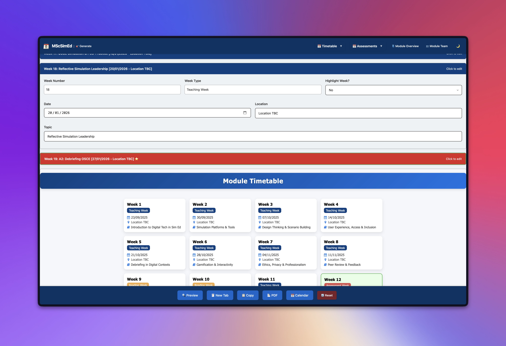

# ModuMate

ModuMate is a browser-based toolkit for creating reusable module content. It can generate timetables, assessment overviews, individual assessment briefs, module overviews and module-team pages from editable JSON presets.

[Open the live demo](https://smcnab1.github.io/modu-mate/)



## Features

- Create and edit timetable presets for different cohorts.
- Generate assessment briefs, assessment overviews and module overviews.
- Build module-team pages from reusable contact-card data.
- Preview content and export supported formats, including HTML, PDF and iCalendar.
- Import and export JSON presets for reuse.
- Switch between light and dark themes.

The repository contains fictional sample people and contact details. Replace them with data you are authorised to use before producing real module content.

## Tech stack

ModuMate is a static application built with HTML, CSS and vanilla JavaScript. It uses browser storage for local preferences and working data. Some pages load Font Awesome or jsPDF from external CDNs, so a network connection is required for all features to work reliably.

There is no server-side authentication or access control. Do not put confidential or sensitive information in a public deployment.

## Local development

Requirements: a current Node.js release and npm.

```bash
git clone https://github.com/smcnab1/modu-mate.git
cd modu-mate
npm ci
npm run lint
python3 -m http.server 8000
```

Open <http://localhost:8000>. Serving the repository over HTTP is recommended because browser security rules can block local file access to presets.

## Contributing and security

Contributions are welcome. Read the [contribution guide](.github/CONTRIBUTING.md) and open a pull request against `master`.

Report ordinary bugs through [GitHub Issues](https://github.com/smcnab1/modu-mate/issues). Please follow the [security policy](.github/SECURITY.md) for vulnerabilities and avoid including private data in public reports.

## Accessibility

ModuMate is designed with WCAG 2.1 AA accessibility principles in mind. See [ACCESSIBILITY.md](ACCESSIBILITY.md) for the implemented considerations and current verification limits.

## Licence

ModuMate is available under the [MIT Licence](LICENSE.md).
